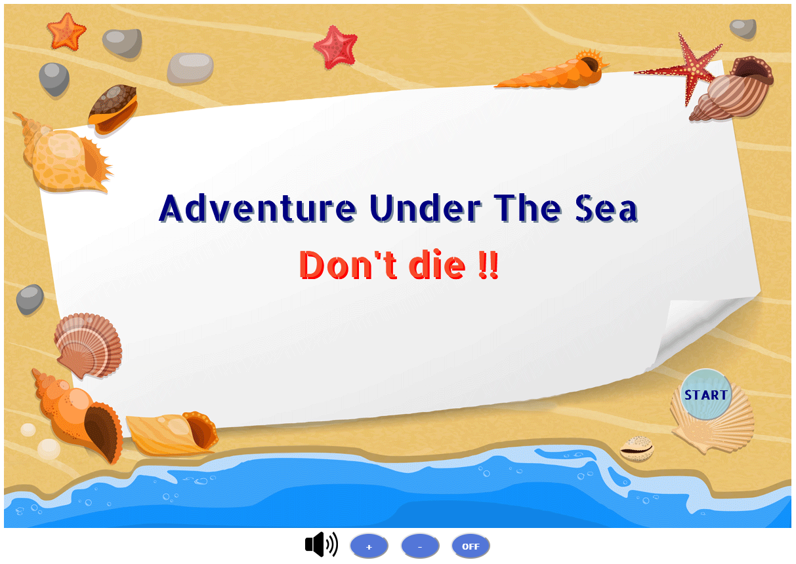

# Adventure_Under_the_Sea

[Click here to see deployed game](https://wenyilulu.github.io/Adventure_Under_the_Sea/)

## Description
This is a little web game, a little adventure under the sea.
Like the evolutions of the life on the Earth, here we start from a little shrimp. 
You will control your role with the mouse movement. Try to eat the foods which are smaller than you and escape the bigger ones. When you cumulate enough the points, you will evolve to a bigger creature. That will let you be able to catch more foods. But you will face to larger predators, so always be careful !

## MVP
- Start screen with start button to launch the game 
- Player movement control by mouse movement
- Collision with bigger predators causes game over
- Score counter
- Collision with foods increases the score
- When game over, show an end screen with restart button

## Backlog
- Level up settings : 
    - level up condition setting : check score 
    - change player and danger image when level up
    - add new foods and new dangers
    - set life counter and collision with jellyfish to decrease life point
    - pause the animation and show level up screen with continue button
- Music settings :
    - Background music for start page and game board
    - Sounds for collisions
    - Buttons for volume control
- More UI/UX design:
    - Back to home page from game over screen
    - CSS styles for : font, buttons effects, colors ...
    - Make home page move
- Local storage
- Split files to make code more readable

## Data structure
- Classes :
    - Fish : for all big fish which come from the right and can cause game over
    - Jellyfish : for all jellyfish which move around and decrease life points
    - Plankton : for all types of foods
- Elements drawing :
    - drawBackground
    - drawPlayer
    - drawFish
    - drawJellyfish
    - drawPlankton, drawRandomFood
    - drawScore
    - drawLife

- Game control:
    - getMousePos: get mouse position to set player's position
    - animate : animation control
    - startGame: set and show game bord 
    - gameOverScreen : set and show game over screen
    - drawLevelUp : show level up informations on the level up screen
    - reset: reset the game to the beginning
    - restartGame: restart the game from the beginning
    - continu : continue the game after level up
    - goBack : go back to the home page after game over
    - setVolume: set the volume of the music and sound effects
- Events listeners:
    - load : for page refresh set up home page
    - click : for all buttons
    - mousemove : for catching mouse position

## States y States Transitions
- [Level 1 game board](./image/screen-shoot/level-1.png)
- [Level 2 game board](./image/screen-shoot/level-2.png)
- [Level 3 game board](./image/screen-shoot/level-3.png)
- [Level up screen 1](./image/screen-shoot/levelUP-1.png)
- [Level up screen 2](./image/screen-shoot/levelUP-2.png)
- [Game over screen](./image/screen-shoot/gameOver-screen.png)
- [Home page when go back](./image/screen-shoot/home-back.png)

## Task
- Monday : MVP
- Tuesday : level up settings
- Wednesday : Music & UI/UX
- Thursday : local storage, documentation, presentation prepar
- Friday : presentation

## Links
- [Slides Link](http://slides.com)
- [Github repository Link](https://github.com/WenyiLULU/Adventure_Under_the_Sea.git)
- [Deployment Link](http://127.0.0.1:5500/index.html)